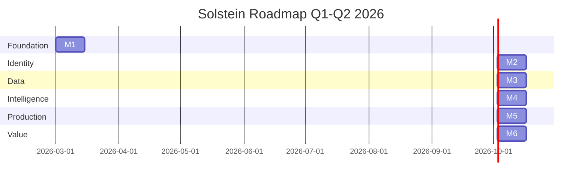
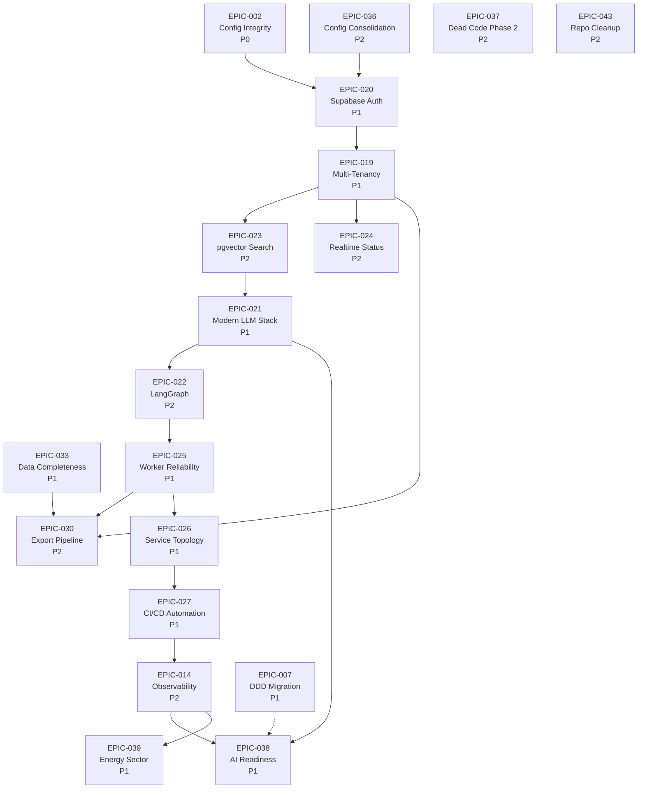

# Milestone Dependency Visualization

> Visual roadmap showing execution order and critical path.

---

## Gantt Chart



---

## Epic Dependency Graph



---

## Critical Path

The critical path (longest sequence of dependent work) determines the minimum project duration:

```
M1 (Safe Foundation)
  └─► M2 (Secure Identity)
        └─► M3 (Modern Data Layer)
              └─► M4 (Intelligent Agents)
                    └─► M5 (Production Ready)
                          └─► M6 (Business Value)
```

**Critical Path Duration:** 12 weeks (84 days)

**Float (slack) available on:**
- EPIC-036, EPIC-037, EPIC-043 (can run in parallel with EPIC-002)
- EPIC-014 (can run in parallel with EPIC-027)

---

## Parallel Work Streams

### Stream 1: Foundation (Weeks 1-2)
- EPIC-002 (P0) — Config Integrity
- EPIC-036, EPIC-037, EPIC-043 (P2) — Cleanup

### Stream 2: Security (Weeks 3-4)
- EPIC-020 (P1) — Supabase Auth
- EPIC-019 (P1) — Multi-Tenancy

### Stream 3: Data (Weeks 5-6)
- EPIC-023 (P2) — pgvector
- EPIC-024 (P2) — Realtime
- EPIC-030 (P2) — Exports
- EPIC-033 (P1) — Data Completeness

### Stream 4: Intelligence (Weeks 7-8)
- EPIC-021 (P1) — LLM Stack
- EPIC-022 (P2) — LangGraph

### Stream 5: Production (Weeks 9-10)
- EPIC-025 (P1) — Workers
- EPIC-026 (P1) — Services
- EPIC-027 (P1) — CI/CD
- EPIC-014 (P2) — Observability

### Stream 6: Value (Weeks 11-12)
- EPIC-038 (P1) — AI Readiness
- EPIC-039 (P1) — Energy Sector

---

## Risk Points

High-risk dependencies that could delay the critical path:

| Dependency | Risk | Mitigation |
|------------|------|------------|
| EPIC-002 → EPIC-020 | Config must be clean before auth | Prioritize EPIC-002, add buffer |
| EPIC-021 → EPIC-022 | LLM stack before LangGraph | Spike story for LangGraph |
| EPIC-025 → EPIC-026 | Workers before services | Test worker reliability early |

---

## Alternative Paths

### Accelerated Path (10 weeks)

If resources allow parallel work:

```
Week 1-2:  M1 (Foundation)
Week 3-4:  M2 (Identity) + Start EPIC-021
Week 5-6:  M3 (Data) + Continue EPIC-021
Week 7-8:  M4 (Intelligence) 
Week 9-10: M5 (Production)
Week 11-12: M6 (Value)
```

**Requires:**
- 2 senior engineers (can work in parallel streams)
- EPIC-021 must be able to start after M2 (not strictly dependent on M3)

### Conservative Path (14 weeks)

If team is new or risks are high:

```
Week 1-2:   M1 (Foundation)
Week 3-4:   M2 (Identity)
Week 5-6:   Buffer / Risk mitigation
Week 7-8:   M3 (Data)
Week 9-10:  M4 (Intelligence)
Week 11-12: M5 (Production)
Week 13-14: M6 (Value)
```

---

## Related

- [M1: Safe Foundation](M1-Safe-Foundation.md)
- [M2: Secure Identity](M2-Secure-Identity.md)
- [M3: Modern Data Layer](M3-Modern-Data-Layer.md)
- [M4: Intelligent Agents](M4-Intelligent-Agents.md)
- [M5: Production Ready](M5-Production-Ready.md)
- [M6: Business Value](M6-Business-Value.md)
