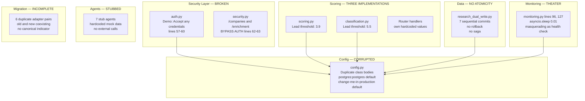
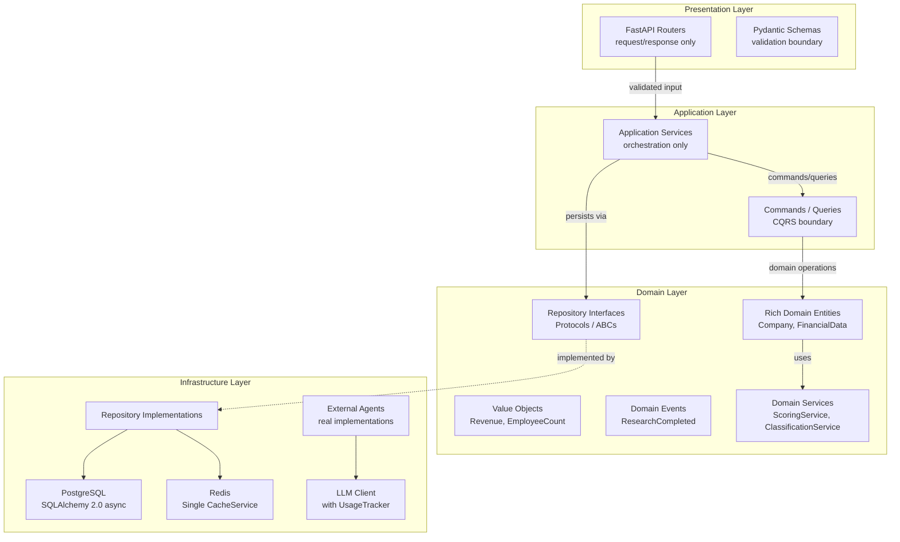
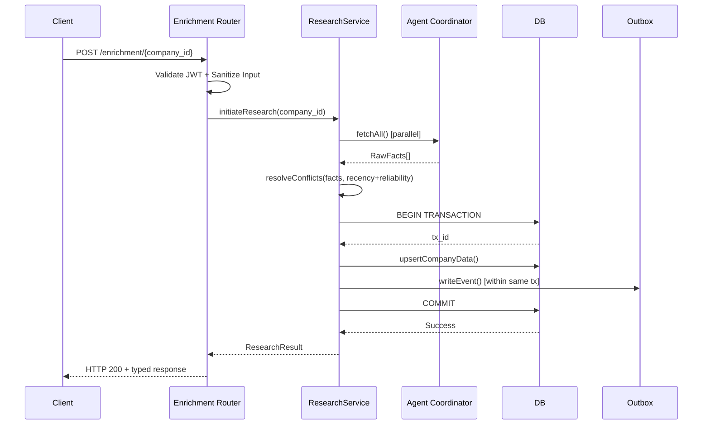
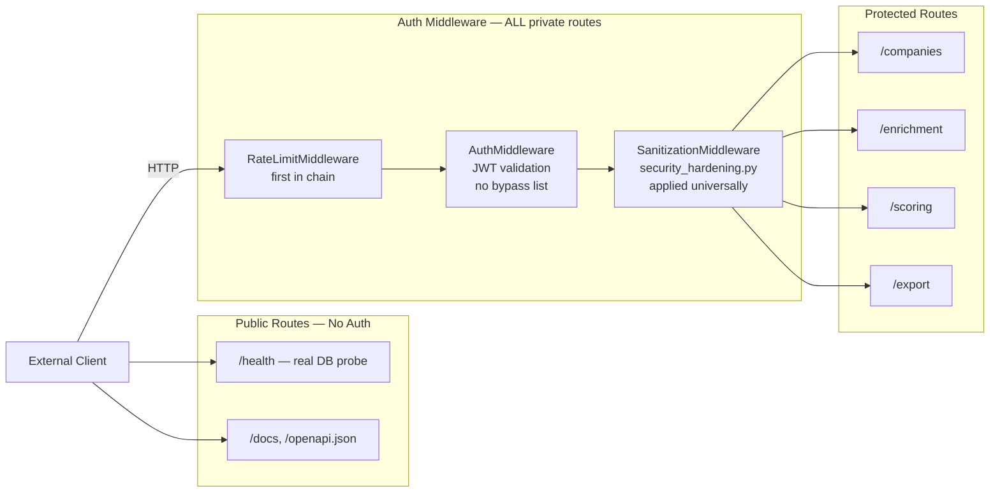
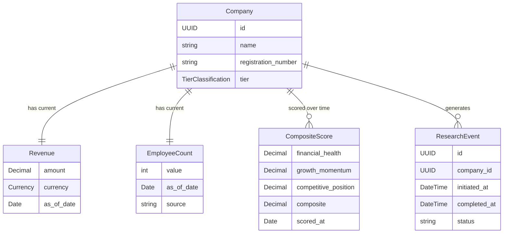
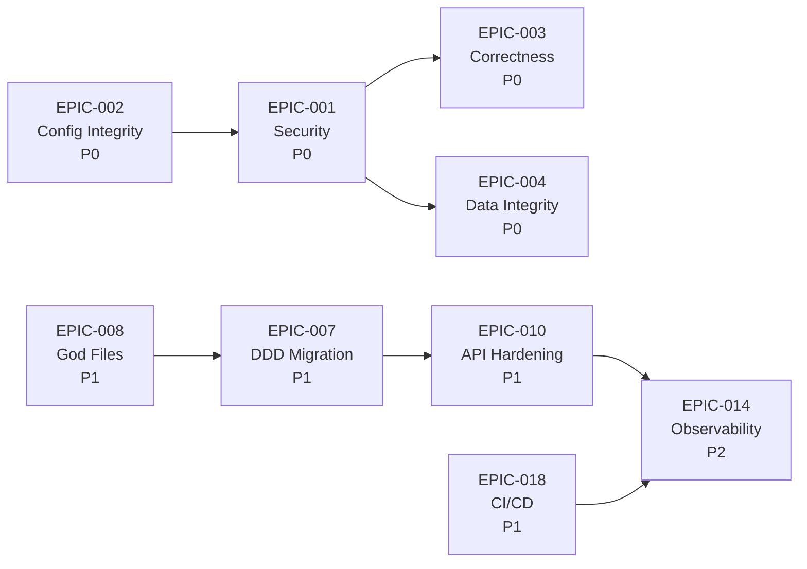

# Solstein: System Map & Target Architecture

> The architecture we have versus the architecture we deserve. Use this as the north star for all remediation work.

> Last Updated: 2026-02-28 | Companion to: [Engineering Backlog](README.md)

---

## 1. Current State — The Reality

The current Solstein architecture is the result of rapid prototyping that was never consolidated. It contains dual middleware systems (one in `middleware/security.py`, another partially in `data/security_hardening.py`), three independent classification threshold definitions that produce different outputs for the same input, an authentication system that explicitly accepts all credentials, and health checks that verify nothing. The diagram below is not a simplification — it is a faithful representation of what the codebase actually does.

---

## 2. Target Clean Architecture

The target architecture follows a strict layered dependency model. Each layer depends only on the layer directly below it. Infrastructure concerns never leak into domain logic. The domain layer has zero framework dependencies.

### Layer Responsibilities

| Layer | Allowed Dependencies | Prohibited |
|-------|---------------------|------------|
| **Presentation** | Application Layer, Pydantic | Database, Redis, LLM clients |
| **Application** | Domain Layer | Direct DB access, HTTP concerns |
| **Domain** | Standard library only | Any framework, any infrastructure |
| **Infrastructure** | Domain interfaces, external libraries | Business logic, HTTP concerns |

---

## 3. Research Pipeline — Target Data Flow

The research pipeline is the platform's most critical data path. It must be atomic, observable, and recoverable.

### Key Invariants

1. **Atomicity**: All writes within a research execution occur within a single database transaction. No partial writes persist.
2. **Outbox ordering**: The outbox record is written within the same transaction as the primary data. It is never committed before the data it references.
3. **Conflict resolution**: When multiple agents return conflicting facts, resolution considers data recency first, source reliability second.
4. **Idempotency**: Re-executing the same research request produces the same result, not duplicate records.

---

## 4. Security Boundary — Target State

Every HTTP request must pass through the full middleware chain unless the route is explicitly documented as public. There are exactly four public routes.

### Public Route Allowlist (Exhaustive)

| Route | Reason |
|-------|--------|
| `/health` | Infrastructure monitoring — must be accessible without credentials |
| `/docs` | OpenAPI documentation browser |
| `/openapi.json` | Machine-readable API specification |
| `/auth/login` | Authentication endpoint — credentials are the input, not a prerequisite |

Any route not in this list requires a valid JWT in the `Authorization` header. No exceptions. No environment-gated bypasses.

---

## 5. Domain Model — Target

The domain model uses value objects for financial quantities, ensuring type safety and preventing primitive obsession. Scores are tracked over time for auditability.

### Value Object Rules

1. Value objects are immutable after construction
2. Equality is based on value, not identity
3. Currency-bearing amounts carry their currency — no implicit GBP assumption
4. Dates use `date` for business dates, `datetime` for timestamps — never strings

---

## 6. Epic Dependency Graph

This graph governs execution order. An epic may not begin until all epics it depends on are complete.

### Reading the Graph

- **Arrows point from prerequisite to dependent.** EPIC-002 must complete before EPIC-001 can begin.
- **Parallel work is permitted** where no arrow connects two epics. EPIC-003 and EPIC-004 can proceed concurrently after EPIC-001.
- **EPIC-002 is the root.** Nothing else starts until configuration is clean.

---

## Appendix: File Locations Quick Reference

| Concern | Current Location | Target Location |
|---------|-----------------|-----------------|
| Authentication | `api/routers/auth.py` | `api/routers/auth.py` (rewritten) |
| Auth Middleware | `api/middleware/security.py` | `api/middleware/auth.py` (dedicated) |
| Sanitization | `data/security_hardening.py` | `api/dependencies/sanitization.py` |
| Configuration | `config.py` (single file) | `config.py` (deduplicated, validated) |
| Classification | `analytics/classification.py` | `domain/scoring/classification.py` |
| Scoring | `analytics/scoring.py` + `analytics/scorers/` | `domain/scoring/` (single implementation) |
| Research Pipeline | `infrastructure/research_dual_write.py` | `application/services/research_service.py` |
| Conflict Resolution | `infrastructure/conflict_resolution.py` | `domain/services/conflict_resolution.py` |
| Data Loading | `data/unified_loader.py` | `infrastructure/loaders/` (decomposed) |
| Health Checks | `monitoring.py` | `api/health.py` (real probes) |
