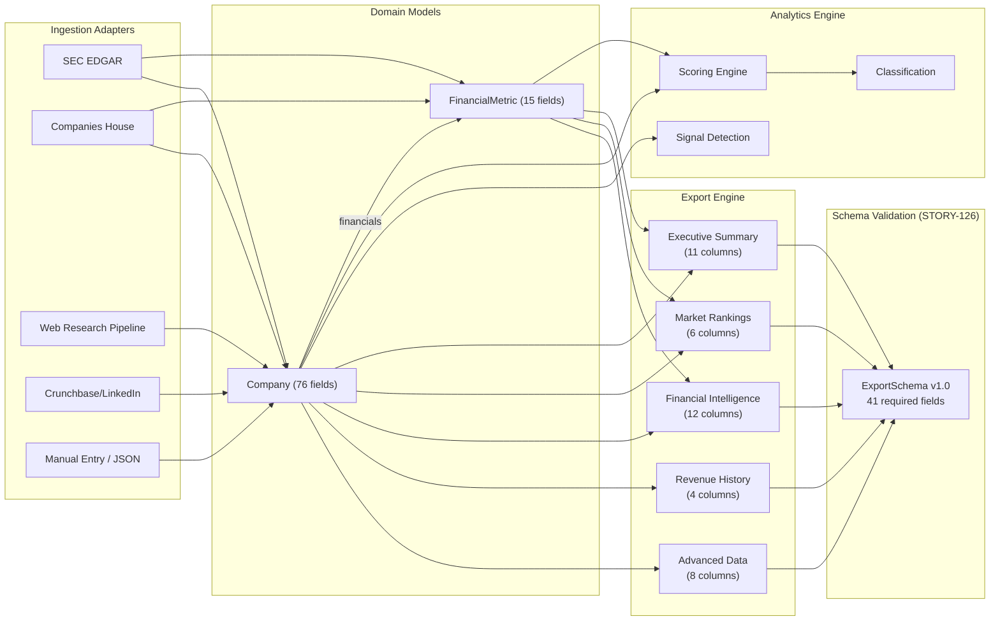

# Field Data Flow Diagram

**Last Updated**: 2026-03-27
**Reflects**: Post-STORY-125/126/127 architecture

## Layer Descriptions

**Ingestion Adapters** fetch raw company data from external sources. Each adapter writes to specific fields on Company or FinancialMetric.

**Domain Models** hold the canonical data. `Company` is the root entity (76 fields). `FinancialMetric` is the canonical source for revenue, profit_margin, employees, and growth metrics (STORY-127).

**Analytics Engine** reads from domain models to compute scores, detect signals, and classify companies. Outputs (ai_score, threat_level, tier, classification) are written back to Company.

**Export Engine** reads from Company and FinancialMetric to produce the Excel dashboard. After generation, the ExportSchema validation (STORY-126) verifies all 41 required field headers are present on their correct sheets.
