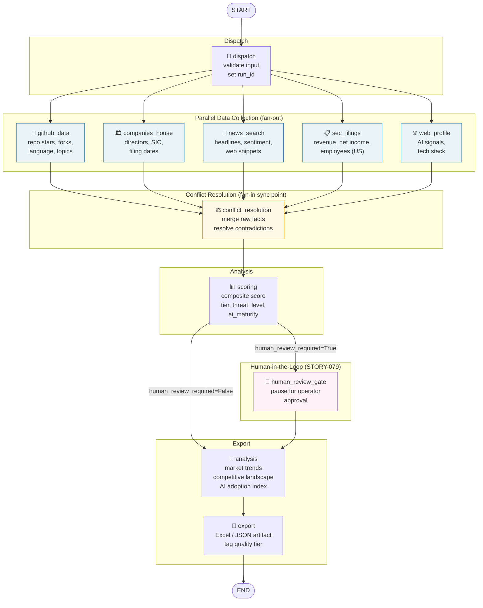

# Research Pipeline Graph Architecture

**STORY-076**: LangGraph State and Research Graph Architecture

This document is the authoritative topology reference for the Solstein research pipeline.
The graph definition in `src/solstein/research/graph/topology.py` is the single source
of truth. This diagram is generated from and must stay in sync with that file.

---

## Pipeline Topology



---

## ResearchState Field Ownership

Each field in `ResearchState` is owned by one node (write authority) and readable by downstream nodes.

| Field | Owned By | Read By |
|-------|----------|---------|
| `run_id` | dispatch | all nodes |
| `company_identifiers` | caller | dispatch, all collection nodes |
| `config` | caller | dispatch, all collection nodes |
| `raw_github_facts` | github_data | conflict_resolution |
| `raw_companies_house_facts` | companies_house | conflict_resolution |
| `raw_news_facts` | news_search | conflict_resolution |
| `raw_sec_facts` | sec_filings | conflict_resolution |
| `raw_web_facts` | web_profile | conflict_resolution |
| `data_collection_errors` | all 5 collection nodes | conflict_resolution, export |
| `conflict_flags` | conflict_resolution | scoring, export |
| `resolved_facts` | conflict_resolution | scoring, analysis |
| `confidence_scores` | scoring | human_review_router, analysis, export |
| `company_scores` | scoring | analysis, export |
| `human_review_required` | scoring | human_review_router |
| `market_analysis` | analysis | export |
| `export_path` | export | caller |
| `export_status` | export | caller |
| `export_errors` | export | caller |
| `completed_nodes` | every node (append) | checkpointing (STORY-079) |
| `pipeline_errors` | any node | export, caller |

---

## Parallelism Model

The five data-collection nodes **run in parallel** via LangGraph's native fan-out.
They are independent: none reads from another's output. The `conflict_resolution`
node is the sync point that receives all five collections before proceeding.

Fan-in merging uses TypedDict Annotated reducers defined in `state.py`:

- `raw_*_facts` fields use `_merge_list` (concatenate lists from all parallel nodes)
- `data_collection_errors` uses `_merge_errors` (concatenate error strings)
- `completed_nodes` uses `_merge_list` (concatenate node names)

---

## Human-in-the-Loop Gate

The `human_review_gate` node is a **placeholder** for the STORY-079 interrupt.
When `scoring` sets `human_review_required = True`, the graph routes through
`human_review_gate` before `analysis`.

STORY-079 will wire a LangGraph `interrupt()` call into this node, causing the
graph to pause and surface low-confidence companies to the operator via the
job status API (EPIC-024).

Trigger conditions for `human_review_required = True`:
- Any company has aggregate confidence score < 0.5
- Unresolved contradictions remain in `conflict_flags`
- All data-collection nodes for a company returned errors

---

## Checkpointing (STORY-079 Preview)

The graph compiles with an optional `checkpointer` argument:

```python
from langgraph.checkpoint.memory import MemorySaver
from solstein.research.graph import compile_research_graph

graph = compile_research_graph(checkpointer=MemorySaver())
```

When a checkpointer is provided, LangGraph automatically saves state after
each node completes. If the process crashes, the graph resumes from the last
successful node — not from `dispatch`. This eliminates redundant API calls
when retrying a failed research job.

---

## Implementation Status

| Story | Status | Description |
|-------|--------|-------------|
| STORY-076 | ✅ Done | This document + `state.py` + `topology.py` |
| STORY-077 | ✅ Landed | `GraphExecutor`, request deduplication, and node error isolation are present in `src/solstein/research/graph/executor.py` |
| STORY-078 | ✅ Partially Landed | Stub agents were deleted and five collection nodes now call real integrations, but downstream fan-in/scoring/export behavior is not yet parity-complete |
| STORY-079 | ✅ Partially Landed | Checkpointer factory, interrupt-driven review queue, and review API are present, but the graph still does not replace the mature end-to-end research pipeline |

---

## Current Branch Reality

As of `origin/develop` on 2026-03-31, the LangGraph runtime is the intended
successor orchestration model, but it is not yet the canonical end-to-end
research execution path.

- The graph runtime exists and is structurally real: topology, executor,
  checkpointing, review queue, and five data-collection nodes are implemented.
- The legacy stage pipeline in `src/solstein/research/pipeline.py` remains the
  more complete behavioral implementation for discovery, enrichment, gating,
  scoring, analysis, and export.
- The graph should therefore be treated as a migration target and architectural
  direction, while the stage pipeline remains the practical reference for
  expected output semantics until feature parity is reached.

This distinction is important for engineering standards: avoid extending both
orchestration paths in parallel. Port mature business behavior from the stage
pipeline into graph-owned services, then retire the legacy runtime instead of
adding more long-lived compatibility seams.

---

## Commit Reality Review (origin/develop)

Reviewed commit trail relevant to graph migration reality:

1. `7ac122a` — STORY-076 LangGraph architecture/state foundations.
2. `4be64bc` — STORY-077 GraphExecutor + dedup + node isolation seam.
3. `43c4999` — STORY-078 real collection-node integrations replacing stubs.
4. `a99bf24` — STORY-079 checkpointing + human-review interrupt path.

Current branch-check interpretation (validated against current code, not only messages):

- Migration intent is explicit and sequential in commit history.
- Runtime parity is still incomplete because downstream business nodes in graph topology are placeholders while stage-pipeline behavior remains mature.
- Therefore the architecture standard remains: use adapters/canonical contracts to migrate behavior into graph-owned paths, and avoid adding new long-lived retro-compat patch layers.

Additional reviewed reference commits:

- `8562cb0` — broad quality baseline before strict boundary audit work.
- `eed7ff2` — validation strictness hardening commit tied to boundary documentation.
- `68cd20e` — external API inventory commit that anchors provider-contract boundary governance.
